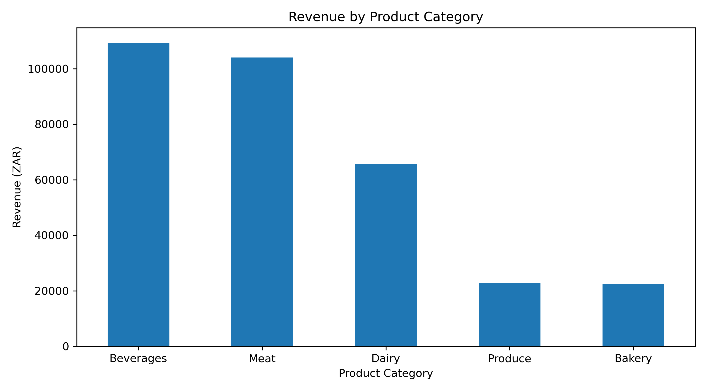
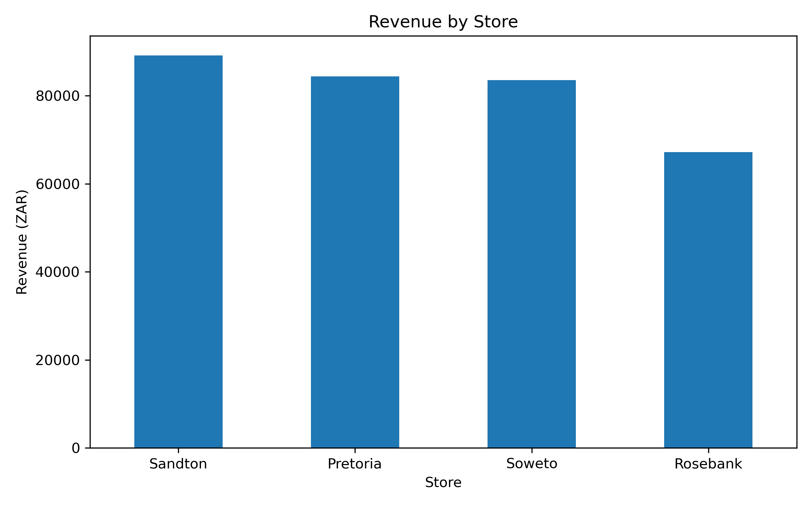
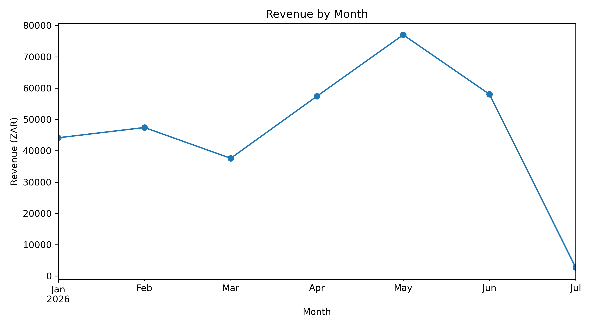

# Retail Sales Data Analysis

## 1. Project Overview

This project is my final capstone for Python Essentials 1 and 2 at Melsoft Academy.

The project analyses sales data for a fictional South African grocery retailer with four branches: Sandton, Pretoria, Soweto and Rosebank.

The main business problem is to understand which products, categories and stores generate the most revenue, how revenue changes over time, how customers pay, and what the results could mean for business decision-making.

I used Python, Pandas and Matplotlib to clean the dataset, calculate revenue, analyse performance, create visualisations and turn the results into practical business insights.

---

## 2. Author

**Name:** Xayan Lovell  
**Cohort:** 2026 DS Jan Cohort  
**Programme:** Python Essentials 1 & 2  
**Project:** Final Capstone – Retail Sales Data Analysis

---

## 3. Dataset

The project uses a synthetic dataset called:

`sales_data.csv`

The dataset was created specifically for the Melsoft Academy final capstone and does not represent a real company.

The original dataset contains **600 individual sales transactions** covering the period from **1 January 2026 to 1 July 2026**.

The original columns are:

- `date` – date of the transaction
- `transaction_id` – unique identifier for each transaction
- `product_id` – product code
- `product_name` – name of the product
- `category` – product category
- `store` – store branch
- `quantity` – number of units sold
- `unit_price` – price per unit in South African Rand
- `payment_method` – method used to pay

The original dataset does not contain a revenue column.

I calculated revenue using:

```python
revenue = quantity * unit_price
```

### Data Quality Problems

The raw dataset contained several deliberate data-quality problems:

- One missing quantity
- One non-numeric unit price
- One negative quantity
- One duplicate row
- One incorrectly formatted date
- Inconsistent text formatting

All data cleaning was completed in Python. I did not manually edit the original CSV.

The dataset started with:

**600 transactions**

After removing the four unusable rows, the cleaned dataset contained:

**596 valid transactions**

The incorrectly formatted date and inconsistent text values were corrected instead of being removed.

---

## 4. How to Run the Project

### Step 1 – Clone the repository

```bash
git clone https://github.com/xayanklovell/retail-sales-analysis.git
```

### Step 2 – Move into the project folder

```bash
cd retail-sales-analysis
```

### Step 3 – Install the required libraries

```bash
pip install -r requirements.txt
```

The project requires:

- pandas
- matplotlib

### Step 4 – Open the analysis notebook

The main analysis is contained in:

```text
analysis.ipynb
```

If you are using VS Code, you can open the project with:

```bash
code .
```

Then open:

```text
analysis.ipynb
```

### Step 5 – Run the notebook

Select a Python kernel and run the notebook from the first cell to the last cell.

The notebook will:

1. Import the required libraries
2. Load the original CSV file
3. Inspect the raw data
4. Detect the data-quality problems
5. Clean the dataset
6. Print a data-quality report
7. Calculate revenue
8. Perform the descriptive analysis
9. Generate the required charts
10. Produce the business insights

The original dataset is loaded from:

```text
data/sales_data.csv
```

The generated charts are saved into:

```text
charts/
```

### Project Structure

```text
retail-sales-analysis/
│
├── charts/
│   ├── revenue_by_category.png
│   ├── revenue_by_month.png
│   └── revenue_by_store.png
│
├── data/
│   └── sales_data.csv
│
├── analysis.ipynb
├── helpers.py
├── README.md
├── requirements.txt
└── .gitignore
```

---

## 5. Key Findings

### Total Revenue

The 596 valid transactions generated total revenue of:

**R324,303.00**

This represents the total sales value across all four stores in the cleaned dataset.

---

### Revenue by Category

Revenue by category was:

- **Beverages:** R109,320.00
- **Meat:** R104,055.00
- **Dairy:** R65,604.00
- **Produce:** R22,806.00
- **Bakery:** R22,518.00

Beverages generated the highest category revenue.

However, Beverages did not sell the most units. Dairy sold more units overall.

This shows that Beverages performed strongly because it combined relatively high sales volume with relatively high product prices.



---

### Revenue by Store

Revenue by store was:

- **Sandton:** R89,137.50
- **Pretoria:** R84,412.00
- **Soweto:** R83,569.00
- **Rosebank:** R67,184.50

Sandton generated the highest revenue, while Rosebank generated the lowest.

Sandton also had the highest average transaction value at approximately:

**R582.60**

However, other stores showed strengths in different areas. Soweto had the highest number of transactions, while Pretoria sold slightly more units than Sandton.



---

### Best-Selling Product vs Highest-Earning Product

The best-selling product by quantity was:

**Rooibos Tea 100g – 570 units**

The highest-earning product by revenue was:

**Coffee Beans 1kg – R77,760.00**

Rooibos Tea 100g sells for approximately **R55.00 per unit**, while Coffee Beans 1kg sells for approximately **R180.00 per unit**.

This demonstrates the difference between sales volume and sales value.

A product can sell more units but still generate less revenue than a higher-priced product selling fewer units.

---

### Monthly Revenue

Monthly revenue was:

- **January:** R44,140.00
- **February:** R47,411.50
- **March:** R37,588.00
- **April:** R57,409.00
- **May:** R77,000.00
- **June:** R58,026.50
- **July:** R2,728.00

The monthly pattern was uneven rather than consistently increasing or decreasing.

May was the strongest complete month, generating:

**R77,000.00**

July appears significantly lower, but this does not represent a normal full month.

The dataset contains only **5 July transactions**, all recorded on **1 July 2026**.

For this reason, July cannot be fairly compared with the previous complete months.



---

### Average Transaction Value

The average transaction generated:

**R544.13**

This means that across the cleaned dataset, the average sales value of one transaction was approximately R544.

---

### Payment Methods

The payment method counts were:

- **Mobile:** 166
- **EFT:** 144
- **Cash:** 143
- **Card:** 143

Mobile was the most frequently used payment method.

However, the payment methods were relatively evenly distributed, so customers were not heavily dependent on only one payment option.

---

## 6. Recommendations

Based on the results of my analysis, I would recommend that the business focus on the following areas.

### Consider Sandton for Further Investment

Sandton generated the highest overall revenue and the highest average transaction value.

Based on the current sales data, it appears to be a strong candidate for further investment.

However, I would not make a final investment decision using revenue alone.

Before committing additional resources, I would want to understand the store's operating costs, profitability, customer numbers and long-term growth.

### Protect the Performance of Beverages and Meat

Beverages and Meat are the two strongest revenue-generating categories.

The business should closely monitor stock availability, pricing and customer demand within these categories.

Running out of high-performing products in these categories could have a significant effect on revenue.

### Consider Both Volume and Revenue When Evaluating Products

The Rooibos Tea and Coffee Beans results show why products should not be evaluated using quantity alone.

High-volume products may be important for customer demand, while higher-priced products may contribute significantly more revenue.

The business should therefore consider both units sold and revenue when making product decisions.

### Investigate Strong Months

April and May showed a strong increase in revenue, with May reaching the highest complete-month revenue.

The business should investigate what happened during these periods.

Possible factors to investigate include:

- Promotions
- Seasonal demand
- Product mix
- Store performance
- Stock availability
- Customer traffic

The current dataset shows that revenue changed, but it does not provide enough information to prove exactly why it changed.

### Investigate Lower-Performing Areas

Rosebank generated the lowest store revenue.

March also showed lower monthly revenue than the surrounding months.

These areas should be investigated further to understand whether performance was affected by customer demand, inventory, competition, pricing or other business factors.

---

## 7. Limitations and Next Steps

One major limitation of this analysis is that the dataset contains sales revenue information but does not contain information about business costs or profit.

This means I can identify which stores, categories and products generate the most revenue, but I cannot determine which are actually the most profitable.

For example, Sandton generated the highest revenue.

However, without information about expenses such as rent, salaries, stock costs, utilities and other operating costs, I cannot conclude that Sandton generates the highest profit.

The analysis would be stronger with additional information such as:

- Product cost prices
- Profit margins
- Store operating expenses
- Customer numbers
- Store size
- Inventory levels
- Stock shortages
- Promotions and discounts
- Historical sales data
- Customer demographics
- Local competition

Another limitation is that July is incomplete because the dataset only contains transactions from 1 July.

The dataset is also synthetic, meaning the conclusions apply only to this capstone dataset and not to a real retailer.

### Next Steps

If more business data became available, I would expand the project by analysing:

- Profitability by product and store
- Revenue compared with operating expenses
- Customer purchasing behaviour
- Stock performance
- Promotion effectiveness
- Longer-term sales trends
- Store growth over time

---

## 8. Tools and Skills Used

### Tools

- Python
- Pandas
- Matplotlib
- Jupyter Notebook
- VS Code
- Git
- GitHub

### Python Essentials Skills Applied

This project uses concepts from both Python Essentials 1 and Python Essentials 2, including:

- Variables
- Data types
- Functions
- Loops
- Conditional logic
- Imports
- Modules
- File paths
- Pandas DataFrames
- Data cleaning
- Missing-value handling
- Datetime processing
- Grouping
- Aggregation
- Sorting
- Calculations
- Matplotlib visualisation
- Reusable functions

I created reusable functions inside:

```text
helpers.py
```

The `revenue_by_group()` function is used to calculate and rank revenue for different groups such as categories and stores.

The `save_chart()` function is used to save Matplotlib figures consistently into the `charts` folder.

This reduces repeated code and makes the project easier to maintain.

---

This project demonstrates the process of turning raw, messy sales data into structured information that can support business decisions.

The main lesson I took from the project is that producing the numbers is only part of data analysis. The more important step is understanding what those numbers mean, recognising the limitations of the data and using the results to ask better business questions.